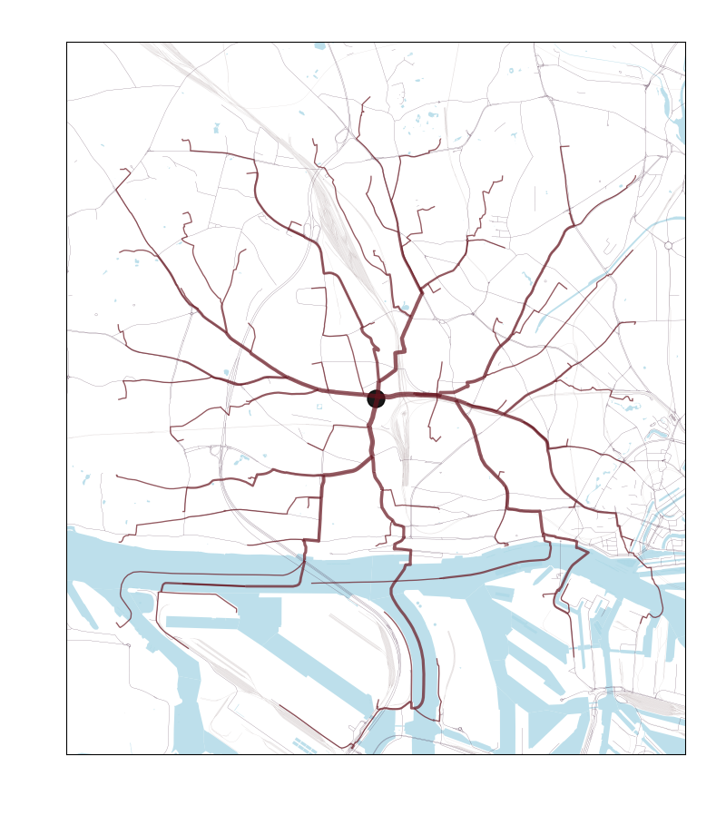
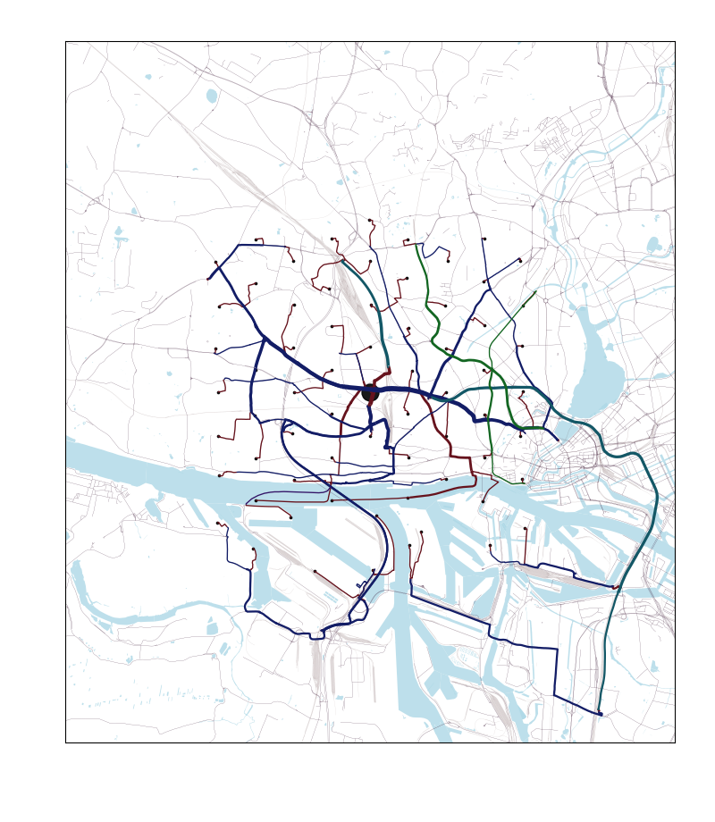
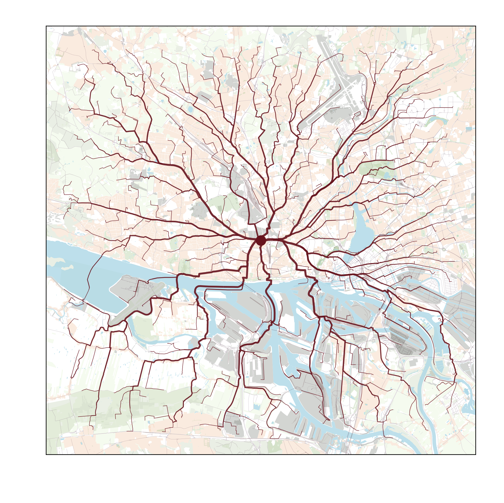
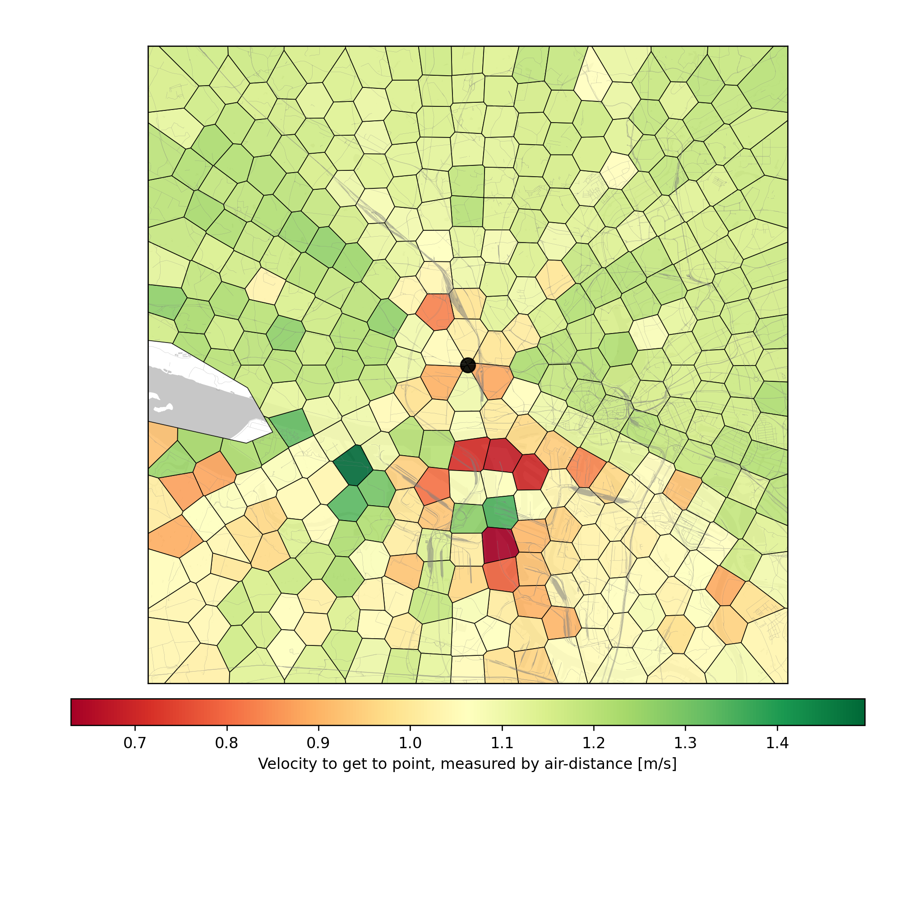
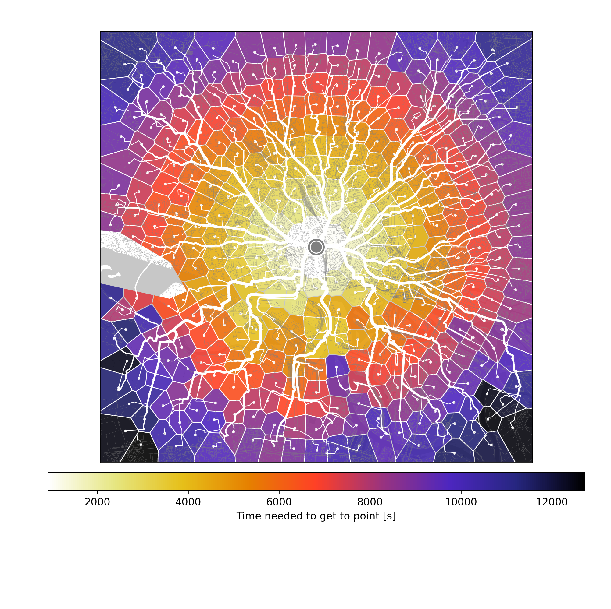
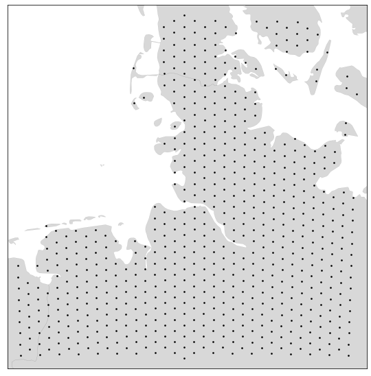
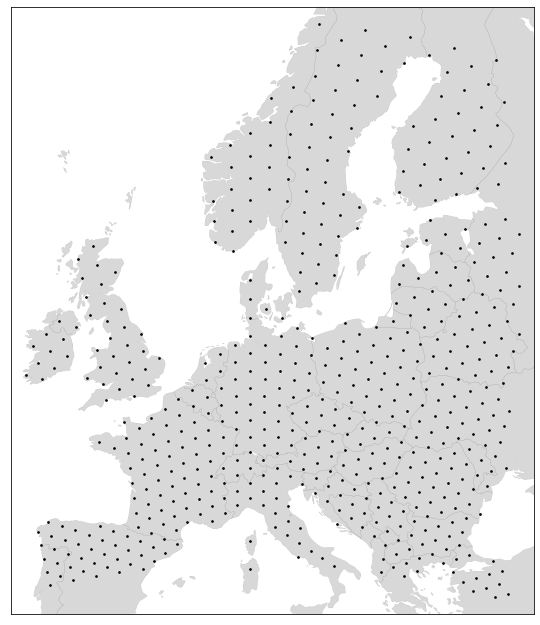
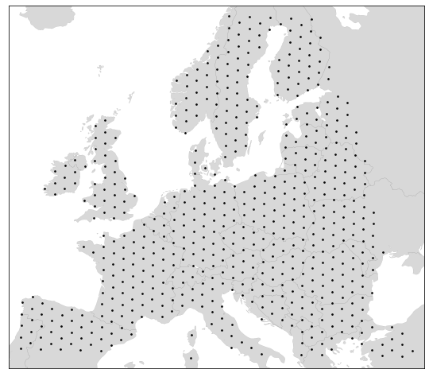

# Maptra

Creating maps that visualise transportation and travel, starting from a single starting point to many end points. 
Using the google maps api.

## Examples

### Sample script

```python
#sample1.py

from maptra import Map, CreateLocations, Visualization, Location

Map.set_gmaps_api_key("your key here") #Put in your own api key string.

m = Map(Location([53.563, 9.928]))
locas = CreateLocations.on_hexagonal_grid(m.start, 1000, [4000])
m.add_locations(locas)

viz = Visualization(m)
folder = 'data/hamburg/osmaxx/simplified'
viz.add_background_fromfile(f'{folder}/road_l.shp', color='#290022', alpha=0.8)
viz.add_background_fromfile(f'{folder}/railway_l.shp', color='#330306', alpha=0.2)
viz.add_background_fromfile(f'{folder}/water_a.shp', color='lightblue', alpha=0.8)
                            
viz.add_lines()
viz.add_startpoint()
viz.showfig()

viz.savefig('map_walking.png', minwidth=800, minheight=800)
```

Here the output:



### Sample script 2

Changing the transportation mode from `walking` to `transit`, and tweaking a few visualization parameters (see `sample2.py`), the map becomes:



(Each color represents a different transportation mode, such as 'walking', 'bus', 'subway', 'train', etc.)

### Sample script, 3

There is a somewhat larger `sample3.py` script included in the repo as well, which I used to create these maps:

Route to various locations:


How fast you get to those locations:


How long it takes to get there, plus the route, in a trippy color scheme:


## What you need

### Packages / Dependencies

This project wouldn't be anywhere if it weren't for great projects it heavily depends on.
Most dependencies are relatively standard, like `numpy`, `pandas`, `geopandas`, `shapely`.
Others are a bit less common, but still installable with `pip`. These are `pygeodesy` (working with lat-lon-points on a globe), `googlemaps` (wrapper for google maps api), `colorama` (to output colored text to the console). There might be dependencies of dependencies, but you'll be made aware if a package is missing. 
Ah, and I've written this for python >= 3.8.

### Api key

Currently, all directions are obtained from the google maps api. Get a key [here](https://developers.google.com/maps/documentation/embed/get-api-key). At the time of writing, there is a free trial available for a certain number of directions and geocoding queries. If you want to make a map of your country in 100m resolution, and you don't live in the Vatican, this might get expensive, so please check first what the current google prices and quota are.

### Map material

If you want to include roads, rivers, areas, etc. in your map, you'll need to get some shape files. The [OSMaxx website](https://osmaxx.hsr.ch) is a great resource for this, as it's free and versatile. You can select the area you are interested in; select the 'Esri Shapefile' in 'WGS 84' coordinate system (aka `epsg:4326`). Pick the detail level you want, and keep in mind the dataset can get pretty large for the 'full detail' option.

### Some knowledge about projections

When creating a visualization, you'll need to pick a crs (coordinate reference system). There are many to choose from, but not all work for every geographical area. A good resource is the website [epsg.io](https://epsg.io/). By default, `Visualization` uses the Mercator projection (aka `epsg:3395`), which keeps north/south lines vertical and east/west lines horizontal anywhere on the map. It's good enough for small geographic areas, especially those that don't have a large latitude (i.e., north-south) span and are not near the poles.

Here a quick comparison that shows the mercator distortion is minor on a map spanning 300 km, but becomes quite noticable on one spanning 3000 km. It is compared to the crs 'epsg:5243' that is more suitable for europe:

`epsg:3395` (i.e., Mercator) | `epsg:5243`
:-------------------------:|:-------------------------:
  |  
  |  


 
