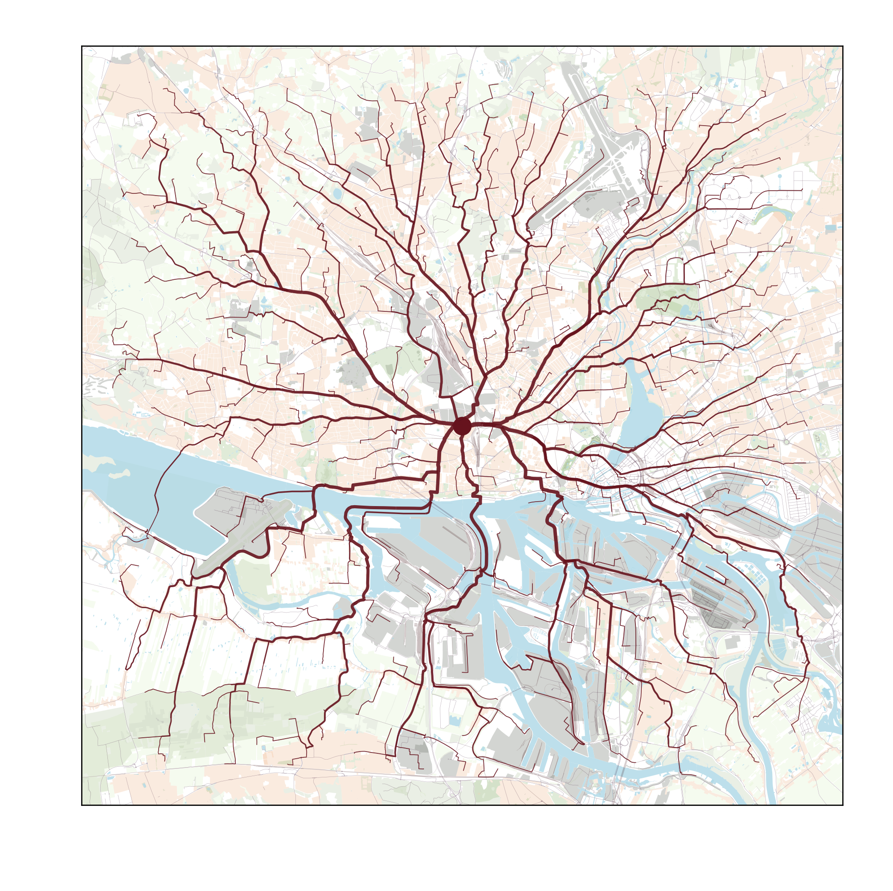
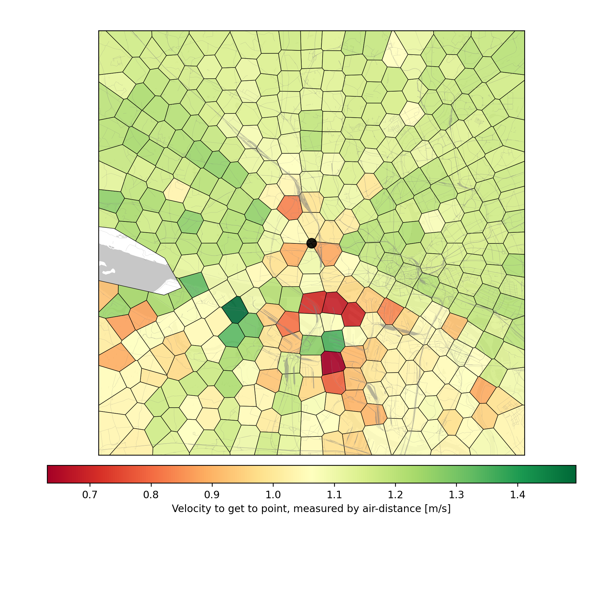
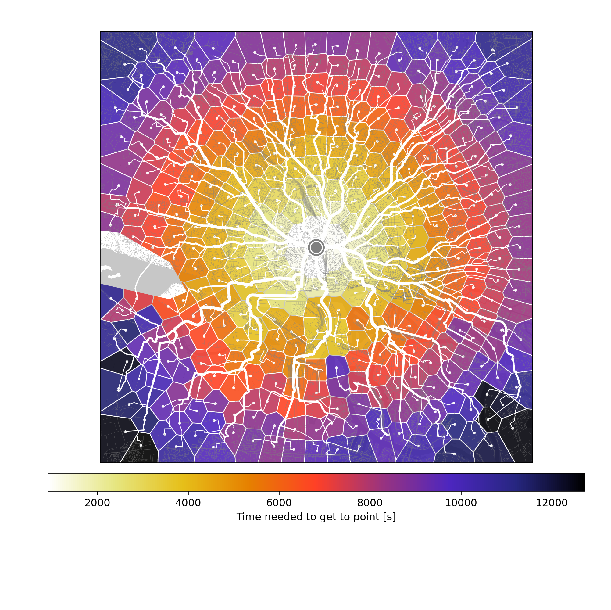

# Maptra

Creating maps that visualise transportation and travel, starting from a single starting point to many end points. 
Using the google maps api.

## Examples

### Sample script

```python
from maptra import Map, CreateLocations, Visualization

Map.set_gmaps_api_key("apikey") #Put in your own api key string.

m = Map((53.563, 9.928), 'walking')
locas = CreateLocations.on_hexagonal_grid(m.start, 1000, [4000])
m.add_locations(locas)

viz = Visualization(m)
folder = 'data/hamburg/osmaxx/simplified'
viz.add_background_fromfile(f'{folder}/road_l.shp', color='#290022', alpha=0.8)
viz.add_background_fromfile(f'{folder}/railway_l.shp', color='#330306', alpha=0.2)
viz.add_background_fromfile(f'{folder}/water_a.shp', color='lightblue', alpha=0.8)
                            
viz.add_lines()
viz.add_startpoint()
viz.showfig()

viz.savefig(f'sample_short.png', minwidth=800, minheight=800)
```

Here the output:


### Sample script, 2

There is a somewhat larger `sample.py` script included in the repo.

### Gallery

Some example maps I've created with a friend's appartment as the starting point:





## What you need

### Packages / Dependencies

This project wouldn't be anywhere if it weren't for great projects it heavily depends on.
Most dependencies are relatively standard, like `numpy`, `pandas`, `geopandas`, `shapely`.
Others are a bit less common, but still installable with `pip`. These are `pygeodesy` (working with lat-lon-points on a globe), `googlemaps` (wrapper for google maps api), `colorama` (to output colored text to the console),  

### Api key

Currently, all directions are obtained from the google maps api. Get a key [here](https://developers.google.com/maps/documentation/embed/get-api-key). At the time of writing, there is a free trial available for a certain number of directions and geocoding queries. If you want to make a map of your country in 100m resolution, and you don't live in the Vatican, this might get expensive, so please check first what the current google prices and quota are.

### Map material

If you want to include roads, rivers, areas, etc. in your map, you'll need to get some shape files. The [OSMaxx website](https://osmaxx.hsr.ch) is a great resource for this, as it's free and versatile. You can select the area you are interested in; select the 'Esri Shapefile' in 'WGS 84' coordinate system. Pick the detail level you want, and keep in mind the dataset can get pretty large for the 'full detail' option.
